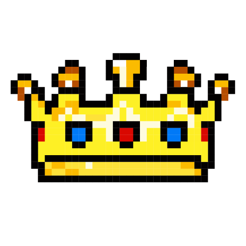

 

# MIDAS

> [!NOTE]
> Migrationsverkets Designsystem - MIDAS

## Quickstart

### Start Documentation

To start the Documentation run `nx serve docs`

### Start Storybook instance

To start the Storybook instance run `nx storybook storybook-host`

### Start the Playground app

To start the development server run `nx serve playground`. Open your browser and navigate to http://localhost:4200/.

### Explore the Project Graph

Run `nx graph` to show the graph of the workspace.
It will show tasks that you can run with Nx.

## Contribute

### Bidra med design och kod

Designsystemet är inner source och alla bidrag uppmuntras. Har du lösningen på en bugg eller vill bidra med en ny
feature eller komponent? Läs igenom våra grundläggande designprinciper på docweben för att se hur
ditt bidrag passar in i helheten.

Om du vill bidra med kod, titta också på våra guider för att komma igång med utvecklingen på ett
smidigt sätt.

[Lokal setup](/doc/local-setup.md)
[Bygg en komponent](/doc/build-component.md)
[Hantera Git](/doc/git)
[Publicera komponenter](/doc/publish)

### Process

Designsystemet är fortfarande i beta-version och processen av förbättringsarbete är under konstant utveckling. Allt utgår
dock från att behovet identifieras (externt eller internt) och att ett ärende skapas.

- Analys av behov
- Konceptuell lösning
- Beslut och prioritering
- Input från intressenter
- Tilldela uppgiften
- Leverera

Alla feature requests har inte samma komplexitet och buggfixar behöver sannolikt inte gå igenom samma process av analys.
