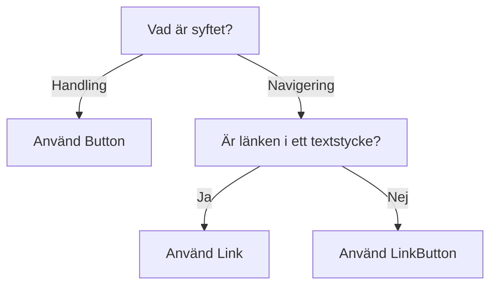

import { PropTable } from '@site/src/components/propsTable';
import { Button } from '@midas-ds/button'
import { ComponentHeader, ComponentFooter } from '@site/src/components/getComponentMetaData';
import Info from '@site/static/data/button.json'
import { Flex, FlexItem } from '@midas-ds/flex'
import LiveCodeBlock from '@site/src/components/CodeBlock/CodeBlock'
import { Plus } from 'lucide-react'

<ComponentHeader name={'Button'} info={Info} friendlyName={'Knapp'}/>

## Introduktion

Knappar används när användaren vill utföra en handling t.ex. spara ifylld information eller öppna ett formulär.

## Installation och användning

```bash npm2yarn
npm install @midas-ds/button
```

```tsx
import { Button } from '@midas-ds/button';
```

<LiveCodeBlock scope={{Flex, FlexItem, Button}}>
{`<Flex>
  <FlexItem col="auto">
    <Button>{fruits.shuffled(1).name}</Button>
  </FlexItem>
  <FlexItem col="auto">
    <Button variant="secondary">{fruits.shuffled(1).name}</Button>
  </FlexItem>
  <FlexItem col="auto">
    <Button isDisabled>{fruits.shuffled(1).name}</Button>
  </FlexItem>
</Flex>`}
</LiveCodeBlock>


## Primärknapp

Den primära knapp används för den primära/positiva handlingar i ett flöde (OK,Skicka, Nästa). Det bör endast finnas en primärknapp per sida/sektion/tydligt avgränsad yta. 
  
  <Button>Slutför</Button>


## Sekundär knapp
Sekundär knapp används för underordnade/negativa handlingar i ett flöde (Avbryt, Tillbaka).

  <Button variant={'secondary'}>Tillbaka</Button>

## Tertiär knapp

Den tertiära knappen kan användas tillsammans med primär- och sekundärknapp där det finns behov av ett ytterligare val

<div style={{ gap: '8px', display: 'flex', margin: '8px' }}>
  <Button>Slutför</Button>
  <Button variant={'secondary'}>Tillbaka</Button>
  <Button variant={'tertiary'}>Ta bort anmälan</Button>
  </div>

  <br/>

Om den tertiära knappen används fristående från andra knappar ska den ha en ikon. Ikonen läggs till via `icon`.

```tsx
import { Plus } from 'lucide-react'
  <Button icon={Plus} variant={'tertiary'}>Lägg till rad</Button>
```

  <Button icon={Plus} variant={'tertiary'}>Lägg till rad</Button>


## Små knappar
För interna system finns det en liten version av knapparna som kan användas där det är ont om utrymme. Byt till liten knapp med `size={'small'}`

<div style={{ gap: '8px', display: 'flex', margin: '8px' }}>
  <Button size={'small'}>Primär</Button>
  <Button size={'small'} variant={'secondary'}>Sekundär</Button>
  <Button size={'small'} variant={'tertiary'}>Tertiär</Button>
  </div>

## Riktlinjer

### Val av komponent


### Generella riktlinjer

- Alla knappar i externa system ska gå att interagera med. Om användaren inte uppfyllt kraven (t.ex för att gå till nästa sida i en etjänst) ska ett felmeddelande visas som påtalar vad som krävs för att kunna gå vidare.
- Undvik att ha för många knappar på samma sida.

### Placering och ordning

Knappar placeras i regel i nedre vänstra hörnet. Vi sätter alltid den primära knappen till vänster. Undantaget är flerstegsflöden såsom e-tjänster, se nedan.

<div style={{ gap: '8px', display: 'flex', margin: '8px' }}>
  <Button>Skicka</Button>
  <Button variant={'secondary'}>Avbryt</Button>
 </div>


<br/>
I flerstegsflöden, som t.ex. e-tjänster, sätts alltid den primära knappen (nästa) till höger och den sekundära (tillbaka) till vänster. Flödet går från vänster till höger (som att bläddra i en bok) och knapparna motsvarar detta.


<div style={{ gap: '8px', display: 'flex', margin: '8px' }}>
  <Button variant={'secondary'}>Föregående</Button>
  <Button>Nästa</Button>
</div>


## Dependencies

<ComponentFooter info={Info}/>