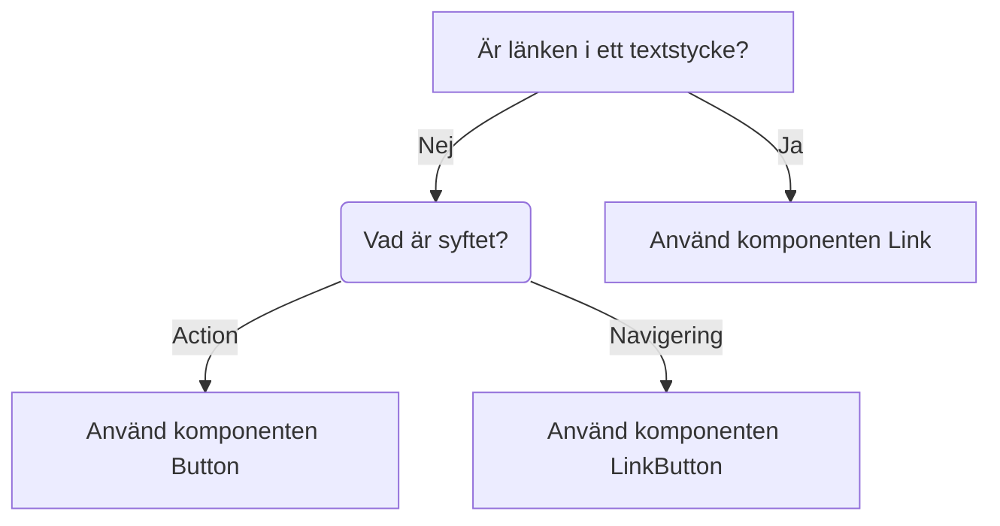

import { PropTable } from '@site/src/components/propsTable';
import { Button } from '@migrationsverket/button'
import { ComponentHeader, ComponentFooter } from '@site/src/components/getComponentMetaData';
import Info from '@site/static/data/button.json'

<ComponentHeader name={'button'} info={Info} friendlyName={'Knapp'}/>

# Introduktion

Knappar används när användaren vill utföra en handling t.ex. spara ifylld information eller öppna ett formulär.

## Installation och användning

```bash npm2yarn
npm install @migrationsverket/button
```

```tsx
import { Button } from '@migrationsverket/button';
```

## Exempel

<div
  style={{
    marginBottom: '10px',
    display: 'flex',
    columnGap: '10px',
    alignItems: 'center',
  }}
>
  <Button>Primary</Button>
  <Button variant={'secondary'}>Secondary</Button>
  <Button isDisabled>Disabled</Button>
</div>

```tsx
<Button>Primary</Button>
<Button variant={'secondary'}>Secondary</Button>
<Button isDisabled>Disabled</Button>
```


## Headlessreferens

Knappen bygger på [React Aria Button](https://react-spectrum.adobe.com/react-aria/Button.html)


## Dependencies

<ComponentFooter info={Info}/>

## Riktlinjer

- Vägledning för val av komponent



- Primär knapp används för den primära/positiva handlingar i ett flöde (Acceptera, Gå vidare, Ok osv). Sekundär knapp används för underordnade/negativa handlingar (Avbryt, Tillbaka).
- I e-tjänster sätts alltid den primära knappen (nästa) till höger och den sekundära (tillbaka) till vänster. Det baseras på att formuläret är som en bok som läses från vänster till höger.

<div style={{ gap: '5px', display: 'flex', margin: '5px' }}>
  <Button variant={'secondary'}>Föregående</Button>
  <Button>Nästa</Button>
</div>

- Det bör finnas max en primärknapp per sida/sektion/tydligt avgränsad yta
- Undvik att ha för många knappar på samma sida.
- Alla knappar i externa system ska gå att interagera med.
  - Om användaren inte uppfyllt kraven (tex för att gå till nästa sida i en etjänst) ska ett felmeddelande visas som påtalar vad som krävs för att kunna gå vidare.


