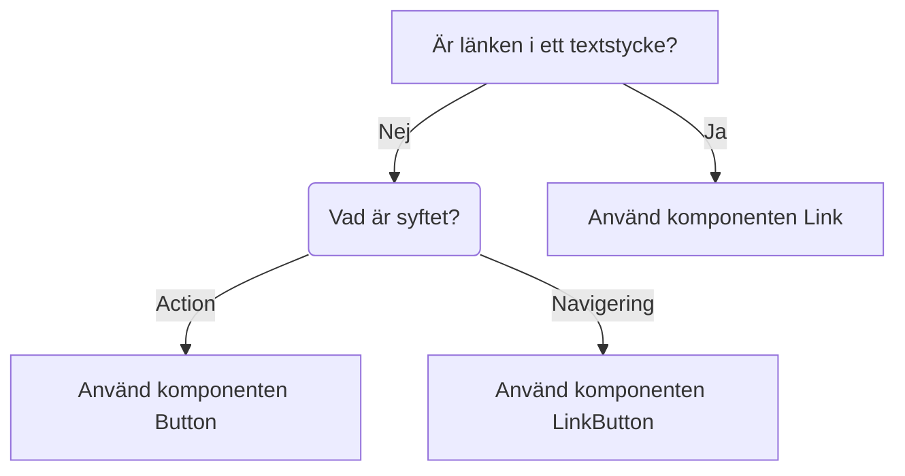

import { PropTable } from '@site/src/components/propsTable';
import { Button } from '@midas-ds/button'
import { ComponentHeader, ComponentFooter } from '@site/src/components/getComponentMetaData';
import Info from '@site/static/data/button.json'
import { Flex, FlexItem } from '@midas-ds/flex'
import LiveCodeBlock from '@site/src/components/CodeBlock/CodeBlock'

<ComponentHeader name={'Button'} info={Info} friendlyName={'Knapp'}/>

## Introduktion

Knappar används när användaren vill utföra en handling t.ex. spara ifylld information eller öppna ett formulär.

## Installation och användning

```bash npm2yarn
npm install @midas-ds/button
```

```tsx
import { Button } from '@midas-ds/button';
```

<LiveCodeBlock scope={{Flex, FlexItem, Button}}>
{`<Flex>
  <FlexItem col="auto">
    <Button>{fruits.shuffled(1).name}</Button>
  </FlexItem>
  <FlexItem col="auto">
    <Button variant="secondary">{fruits.shuffled(1).name}</Button>
  </FlexItem>
  <FlexItem col="auto">
    <Button isDisabled>{fruits.shuffled(1).name}</Button>
  </FlexItem>
</Flex>`}
</LiveCodeBlock>

## Riktlinjer

### Vägledning för val av komponent


### Generella regler

- Primär knapp används för den primära/positiva handlingar i ett flöde (Acceptera, Gå vidare, Ok osv). Sekundär knapp används för underordnade/negativa handlingar (Avbryt, Tillbaka).
- Det bör finnas max en primärknapp per sida/sektion/tydligt avgränsad yta. Undvik att ha för många knappar på samma sida.
- Alla knappar i externa system ska gå att interagera med. Om användaren inte uppfyllt kraven (t.ex för att gå till nästa sida i en etjänst) ska ett felmeddelande visas som påtalar vad som krävs för att kunna gå vidare.

### Knappordning

Vi sätter alltid den primära knappen till vänster. Undantaget är flerstegsflöden såsom e-tjänster, se nedan.

<div style={{ gap: '4px', display: 'flex', margin: '8px' }}>
  <Button>Skicka</Button>
  <Button variant={'secondary'}>Avbryt</Button>
 </div>


I flerstegsflöden, som t.ex. e-tjänster, sätts alltid den primära knappen (nästa) till höger och den sekundära (tillbaka) till vänster. 


<div style={{ gap: '4px', display: 'flex', margin: '8px' }}>
  <Button variant={'secondary'}>Föregående</Button>
  <Button>Nästa</Button>
</div>


## Dependencies

<ComponentFooter info={Info}/>