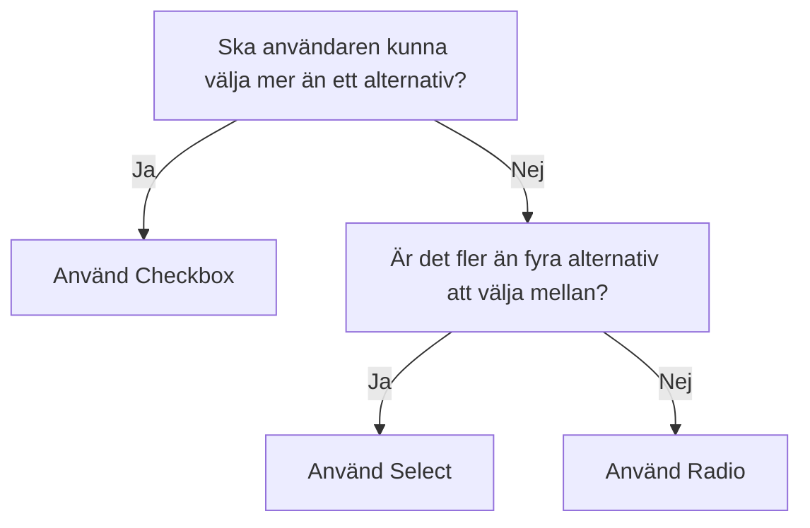

import { PropTable } from '@site/src/components/propsTable';
import {
  DisabledExample,
  GroupExample,
  IndeterminateExample, InvalidExample, ReadOnlyExample,
  SimpleConfirm,
  CheckboxSelectAll
} from "@site/src/components/examples/checkbox/CheckboxExample";
import { ComponentHeader, ComponentFooter } from '@site/src/components/getComponentMetaData';
import Info from '@site/static/data/checkbox.json'

<ComponentHeader name={'Checkbox'} info={Info} friendlyName={'Kryssruta'}/>

## Introduktion

Kryssrutor används för att låta användaren välja inget, ett eller flera alternativ. Om det endast ska gå att välja ett objekt i listan är det en [Radioknapp](./radio.mdx) som ska användas. 

## Installation

```bash npm2yarn
npm install @midas-ds/checkbox
```
```tsx
import {Checkbox} from '@midas-ds/checkbox';
<Checkbox>Jag godkänner villkoren</Checkbox>
```

## Exempel
<SimpleConfirm />

### Gruppera flera checkboxar

Använd `<CheckboxGroup>` för att gruppera flera checkboxar som hör samman.

<GroupExample/>


### Etikett och beskrivning

Etikett för enskild checkbox sätts i template via `<Checkbox>Etikett</Checkbox>`. `<CheckboxGroup>` har en `label` och en `desciption` för ytterligare förklarande text.

### Disabled

När en kryssruta inte är tillämplig i den aktuella situationen ska kryssruta och fältetikett tonas ned via attributet `isDisabled` men inte tas bort.

<DisabledExample/>


### Selected och indeterminate

Använd `isIndeterminate` för att visualisera att vissa men inte alla val inom en viss grupp är gjorda.
Använd `isSelected` för att programmatiskt sätta värdet på en checkbox.

<IndeterminateExample/>

### Validering

Används prop `isInvalid` och implementera lämplig logik för att hantera fel och felmeddelanden. Se [React Aria](https://react-spectrum.adobe.com/react-aria/CheckboxGroup.html#validation)
för ytterligare referens.

<InvalidExample/>

### Readonly och defaultSelected

Sätt prop `isReadonly` när användaren inte ska kunna påverka checkboxens tillstånd. `defaultSelected` sätter checkboxen i ett
valt läge.

<ReadOnlyExample/>

### Välj alla
Ibland kan det vara lämligt att inkludera en checkbox för att "Välja alla". Denna funktion finns inbyggt i `<CheckboxGroup />` via prop: showSelectAll
<CheckboxSelectAll />


## Riktlinjer

### Val av komponent



- Använd inte kryssruta om användaren väntar sig att valet ska få effekt direkt

- Om flera kryssrutor är placerade under varandra, kan det ibland vara lämpligt att användaren kan markera alla kryssrutor
genom att klicka i det översta alternativet, ”Alla”, som är placerat direkt ovanför de ordinarie kryssrutorna.
Rutan ska vara avmarkerad tills användaren klickar i den och då ska alla följande rutor och eventuella subrutor markeras.
Om användaren väljer att avmarkera en post så ska kryssrutan avmarkeras.

- Om ”Markera alla”-kryssruta används på en sida med paginerat innehåll så skall endast de kryssrutor som finns på den aktuella sidan väljas.

- Fältetikett ska inledas med en stor bokstav och inte följas av punkt.

## Dependencies

<ComponentFooter info={Info}/>