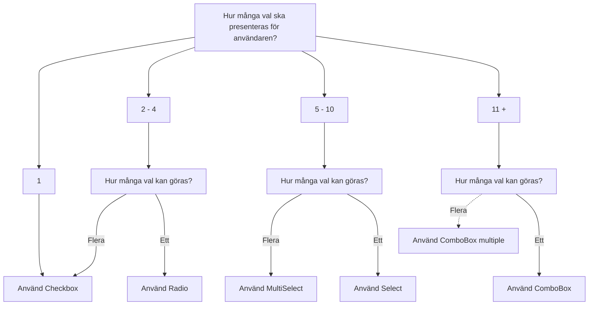

import { PropTable } from '@site/src/components/propsTable'
import {
  ComponentHeader,
  ComponentFooter
} from '@site/src/components/getComponentMetaData'
import Info from '@site/static/data/checkbox.json'
import { Checkbox, CheckboxGroup } from '@midas-ds/checkbox'
import LiveCodeBlock from '@site/src/components/CodeBlock/CodeBlock'
import { Flex, FlexItem } from '@midas-ds/flex'
import { Button } from '@midas-ds/button'

<ComponentHeader
  name={'Checkbox'}
  info={Info}
  friendlyName={'Kryssruta'}
/>

## Introduktion

Kryssrutor används för att låta användaren välja inget, ett eller flera alternativ. Om det endast ska gå att välja ett objekt i listan är det en [Radioknapp](./radio.mdx) som ska användas.

## Installation

```bash npm2yarn
npm install @midas-ds/checkbox
```

```tsx
import { Checkbox } from '@midas-ds/checkbox'
;<Checkbox>Jag godkänner villkoren</Checkbox>
```

## Exempel

<LiveCodeBlock scope={{ Checkbox, Flex, FlexItem, Button }}>
  {`<Flex>
    <FlexItem style={{alignSelf: 'center'}}>
      <Checkbox>Jag godkänner villkoren</Checkbox>
    </FlexItem>
    <FlexItem col="auto" style={{display: 'flex', gap: '0.5rem'}}>
      <Button
        variant='secondary'
      >
        Bakåt
      </Button>
      <Button>Fortsätt</Button>
    </FlexItem>
</Flex>`}
</LiveCodeBlock>

### Gruppera flera checkboxar

Använd `<CheckboxGroup>` för att gruppera flera checkboxar som hör samman.

<LiveCodeBlock scope={{ Checkbox, CheckboxGroup }}>
  {`<CheckboxGroup
        label='Etikett'
        description='Beskrivande text'
      >
        <Checkbox value='1'>Jag har läst texten</Checkbox>
        <Checkbox value='2'>Jag godkänner villkoren</Checkbox>
        <Checkbox value='3'>Jag är över 20 år gammal</Checkbox>
    </CheckboxGroup>
`}
</LiveCodeBlock>

### Etikett och beskrivning

Etikett för enskild checkbox sätts i template via `<Checkbox>Etikett</Checkbox>`. `<CheckboxGroup>` har en `label` och en `desciption` för ytterligare förklarande text.

### Disabled

När en kryssruta inte är tillämplig i den aktuella situationen ska kryssruta och fältetikett tonas ned via attributet `isDisabled` men inte tas bort.

<LiveCodeBlock scope={{ Checkbox }}>
  {`<Checkbox
        isDisabled
        isSelected
      >
        Jag har läst texten
    </Checkbox>
`}
</LiveCodeBlock>

### Validering

Används prop `isInvalid` och implementera lämplig logik för att hantera fel och felmeddelanden. Se [React Aria](https://react-spectrum.adobe.com/react-aria/CheckboxGroup.html#validation)
för ytterligare referens.

<LiveCodeBlock scope={{ Checkbox, CheckboxGroup }}>
  {`<CheckboxGroup
      label="Bekräfta att du är med på tåget"
      errorMessage="Det här ser inte bra ut!"
      isInvalid
    >
      <Checkbox
        value="1"
        isRequired
      >
        Jag har läst texten
      </Checkbox>
      <Checkbox
        value="2"
        isRequired
      >
        Jag godkänner villkoren
      </Checkbox>
  </CheckboxGroup>
`}
</LiveCodeBlock>

### Readonly och defaultSelected

Sätt prop `isReadonly` när användaren inte ska kunna påverka checkboxens tillstånd. `defaultSelected` sätter checkboxen i ett
valt läge.

### Välj alla

Ibland kan det vara lämligt att inkludera en checkbox för att "Välja alla". Denna funktion finns inbyggt i `<CheckboxGroup />` via egenskapen: showSelectAll

<LiveCodeBlock scope={{ Checkbox, CheckboxGroup }}>
  {`<CheckboxGroup
    label={'Välj en frukt'}
    description={'Välj alla eller bara några'}
    showSelectAll
    >
      <Checkbox
        value="1"
        isRequired
      >
        Jag har läst texten
      </Checkbox>
      <Checkbox
        value="2"
        isRequired
      >
        Jag godkänner villkoren
      </Checkbox>
  </CheckboxGroup>
`}
</LiveCodeBlock>

## Riktlinjer

### Val av komponent



- Använd inte kryssruta om användaren väntar sig att valet ska få effekt direkt

- Om flera kryssrutor är placerade under varandra, kan det ibland vara lämpligt att användaren kan markera alla kryssrutor
  genom att klicka i det översta alternativet, ”Alla”, som är placerat direkt ovanför de ordinarie kryssrutorna.
  Rutan ska vara avmarkerad tills användaren klickar i den och då ska alla följande rutor och eventuella subrutor markeras.
  Om användaren väljer att avmarkera en post så ska kryssrutan avmarkeras.

- Om ”Markera alla”-kryssruta används på en sida med paginerat innehåll så skall endast de kryssrutor som finns på den aktuella sidan väljas.

- Fältetikett ska inledas med en stor bokstav och inte följas av punkt.

## Beroenden

<ComponentFooter info={Info} />
