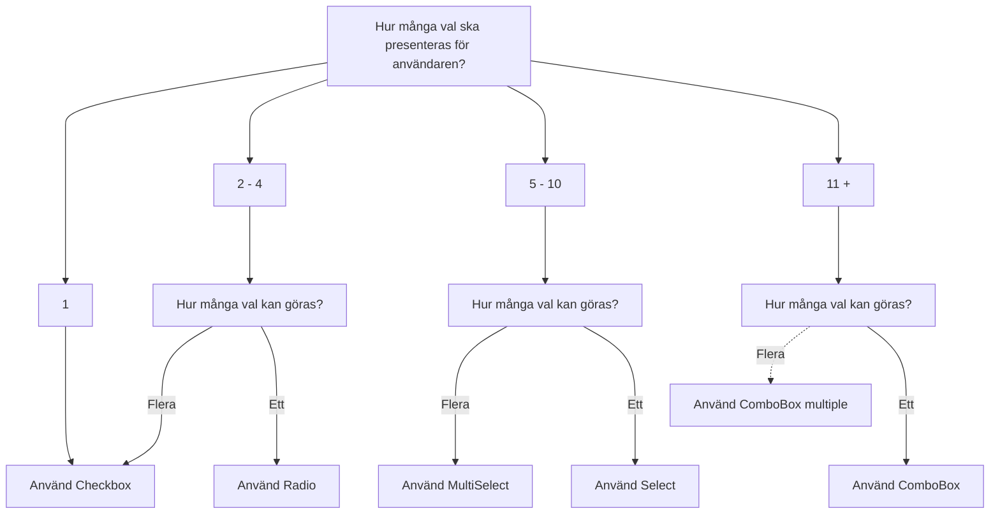

import { PropTable } from '@site/src/components/propsTable'
import { ComponentHeader } from '@site/src/components/getComponentMetaData'
import { Checkbox, CheckboxGroup, Flex, FlexItem, Button } from '@midas-ds/components'
import LiveCodeBlock from '@site/src/components/CodeBlock/CodeBlock'

<ComponentHeader
  name={'Checkbox'}
  friendlyName={'Kryssruta'}
/>

Kryssrutor används för att låta användaren välja inget, ett eller flera alternativ. Om det är många alternativ så bör [MultiSelect](./multi-select.mdx) användas istället.

## Installation och användning

```bash npm2yarn
npm install @midas-ds/components
```

```tsx
import { Checkbox } from '@midas-ds/components'
```

<LiveCodeBlock scope={{ Checkbox, Flex, FlexItem}}>
  {`<Flex>
    <FlexItem style={{alignSelf: 'center'}}>
      <Checkbox>Jag godkänner villkoren</Checkbox>
    </FlexItem>
</Flex>`}
</LiveCodeBlock>

## Varianter

### Ensam checkbox

<LiveCodeBlock scope={{ Checkbox, Flex, FlexItem}}>
  {`<Flex>
    <FlexItem style={{alignSelf: 'center'}}>
      <Checkbox>Jag godkänner villkoren</Checkbox>
    </FlexItem>
</Flex>`}
</LiveCodeBlock>

### Flera checkboxar

Använd `<CheckboxGroup>` för att gruppera flera checkboxar som hör samman.

<LiveCodeBlock scope={{ Checkbox, CheckboxGroup }}>
  {`<CheckboxGroup
        label='Godkänner du våra villkor?'
        description='Läs texten först'
      >
        <Checkbox value='1'>Jag har läst texten</Checkbox>
        <Checkbox value='2'>Jag godkänner villkoren</Checkbox>
    </CheckboxGroup>
`}
</LiveCodeBlock>


## Välj alla

Ibland kan det vara lämligt att ge användaren möjlighet att snabbt kryssa i alla kryssrutor. Denna funktion finns inbyggt i `<CheckboxGroup>` via egenskapen `showSelectAll`. Om detta används på en sida med paginerat innehåll så skall endast de kryssrutor som finns på den aktuella sidan väljas.

<LiveCodeBlock scope={{ Checkbox, CheckboxGroup }}>
  {`<CheckboxGroup
    label={'Godkänner du våra villkor'}
    description={'Läs texten först'}
    showSelectAll
    >
      <Checkbox
        value="1"
        isRequired
      >
        Jag har läst texten
      </Checkbox>
      <Checkbox
        value="2"
        isRequired
      >
        Jag godkänner villkoren
      </Checkbox>
  </CheckboxGroup>
`}
</LiveCodeBlock>

## Riktlinjer

### Val av komponent



- Använd inte kryssruta om användaren väntar sig att valet ska få effekt direkt

- Fältetikett ska inledas med en stor bokstav och inte följas av punkt.

## API

### Checkbox

<PropTable name={'Checkbox'} />

### CheckboxGroup

<PropTable name={'Checkbox'} />
