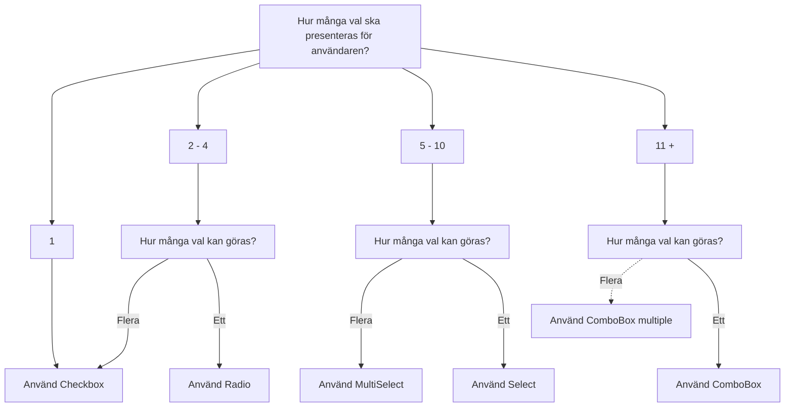

import { PropTable } from '@site/src/components/propsTable'
import { ComponentHeader, ComponentFooter } from '@site/src/components/getComponentMetaData'
import Info from '@site/static/data/combobox.json'
import { ComboBox, ComboBoxItem } from '@midas-ds/combobox'
import LiveCodeBlock from '@site/src/components/CodeBlock/CodeBlock'

<ComponentHeader
  name={'Combobox'}
  info={Info}
  friendlyName='Flerval med sök, väljare med sök, dropdown med sök'
  overrideHeadlessLink='https://react-spectrum.adobe.com/react-aria/ComboBox.html'
/>

## Introduktion

En ComboBox (kombination av Select och TextField) visar en hopfällbar lista med alternativ och låter en användare söka bland dem och välja ett av dem.

ComboBox är en typ av inmatningsfält som används för att välja **ett** alternativ av fler än fyra (4) av flera alternativ. Om det ska gå att välja flera eller inget alternativ är det [Checkbox](./checkbox.mdx) som ska användas Om det är fler alternativ än färre än fyra (4) används med fördel [Radio](./radio.mdx) istället.

## Installation och användning

```bash npm2yarn
npm install @midas-ds/combobox
```

```tsx
import { ComboBox } from '@midas-ds/combobox'
```

<LiveCodeBlock scope={{ ComboBox, ComboBoxItem }}>
  {`<ComboBox
    label="Vad är din favoritfrukt?"
    placeholder="Välj en frukt"
    items={fruits.map(fruit => {return {id: fruit.value, name: fruit.name}})}
>
    {(item) => <ComboBoxItem>{item.name}</ComboBoxItem>}
</ComboBox>`}
</LiveCodeBlock>

## Beroenden

<ComponentFooter info={Info} />

## Riktlinjer

### Val av komponent



<ComponentFooter info={Info} />
