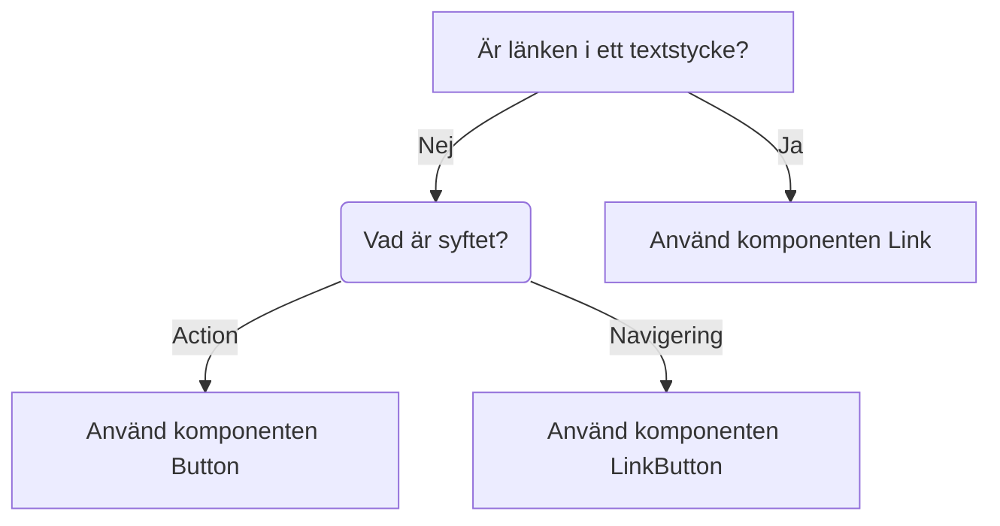

import { PropTable } from "@site/src/components/propsTable";
import { LinkButton } from '@midas-ds/link-button';
import { Flex } from '@midas-ds/flex'
import { ComponentHeader, ComponentFooter } from '@site/src/components/getComponentMetaData';
import Info from '@site/static/data/link.json'
import Mermaid from '@theme/Mermaid';

<ComponentHeader name={'LinkButton'} info={Info} friendlyName={'Länkknapp'} overrideHeadlessLink="https://react-spectrum.adobe.com/react-aria/Link.html" />

## Introduktion

Komponent med samma utseende och beteende som knapp men avsedd att använda som länk internt eller externt i en applikation.

## Installation och användning

```bash npm2yarn
npm install @midas-ds/link-button
```

```tsx
import { LinkButton } from '@midas-ds/link-button'
```

```tsx live
<Flex>
  <LinkButton href={'/dream/components'}>Link to page</LinkButton>
  <LinkButton variant={'secondary'} href={'#props'}>Props</LinkButton>
</Flex>
```

### Headlessreferens

Komponenten är [React Aria Link](https://react-spectrum.adobe.com/react-aria/Link.html). Beskrivning av hur `RouterProvider`
används finns på [React Aria Client Side Routing](https://react-spectrum.adobe.com/react-aria/routing.html).

## Client Side Routing

Exempel på uppsättning för [Remix](https://remix.run/docs/en/main) men principen är densamma för andra frameworks.

```tsx
import { Link, RouterProvider } from '@midas-ds/link-button';
import { useNavigate } from '@remix-run/react'; // or any other framwork router
...
export default function App() {
  const navigate = useNavigate();
  return (
      <RouterProvider navigate={navigate}>
          <LinkButton href={'/'}>Home</LinkButton>
          <LinkButton href={'about'}>About</LinkButton>
          <LinkButton href={'more'}>More</LinkButton>
        <Outlet />
      </RouterProvider>
  );
}
```

## Dependencies

<ComponentFooter info={Info}/>

## Riktlinjer

