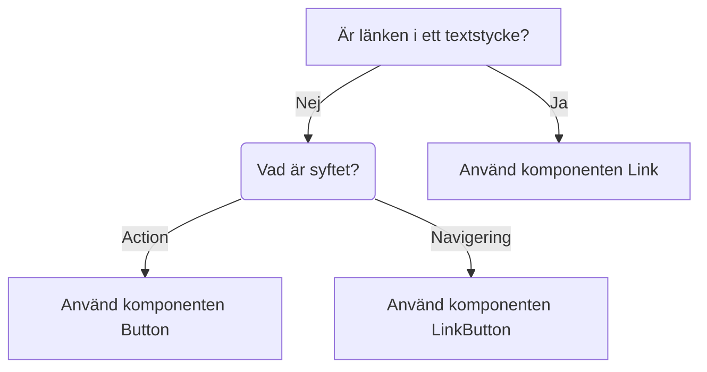

import { PropTable } from "@site/src/components/propsTable";
import { ComponentHeader, ComponentFooter } from '@site/src/components/getComponentMetaData';
import Info from '@site/static/data/link.json'
import { Link } from '@midas-ds/link'

<ComponentHeader name={'Link'} info={Info} friendlyName={'Länk'} />

## Introduktion

Komponenten Link skapar en länk.

## Installation och användning

```bash npm2yarn
npm install @midas-ds/link
```

```tsx
import { Link } from '@midas-ds/link'
```

```tsx live
<Link href="/blog">En länk till designsystemets nyheter</Link>
```

## Riktlinjer



## Dependencies
<ComponentFooter info={Info}/>
