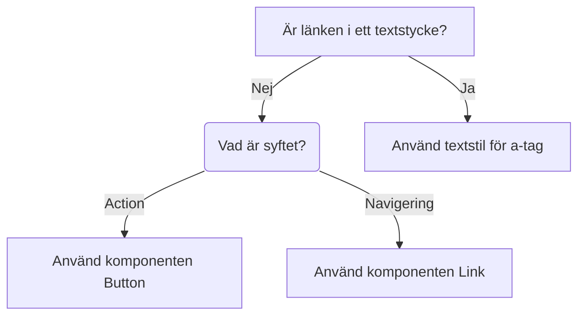

import { PropTable } from "@site/src/components/propsTable";
import { Link } from '../../../../packages/link/src';
import { ComponentHeader, ComponentFooter } from '@site/src/components/getComponentMetaData';
import Info from '@site/static/data/link.json'
import Mermaid from '@theme/Mermaid';

<ComponentHeader name={'link'} info={Info} friendlyName={'Länkknapp'}/>

# Introduktion

Komponent med samma utseende och beteende som knapp men avsedd att använda som länk internt eller externt i en applikation.

## Headless referens

Komponenten är [React Aria Link](https://react-spectrum.adobe.com/react-aria/Link.html). Beskrivning av hur `RouterProvider`
används finns på [React Aria Client Side Routing](https://react-spectrum.adobe.com/react-aria/routing.html).

## Installation och användning

```bash npm2yarn
npm install @migrationsverket/link
```

### Client side routing

Exempel på uppsättning för [Remix](https://remix.run/docs/en/main) men principen är densamma för andra frameworks.

```tsx
import { Link, RouterProvider } from '@migrationsverket/link';
import { useNavigate } from '@remix-run/react'; // or any other framwork router
...
export default function App() {
  const navigate = useNavigate();
  return (
      <RouterProvider navigate={navigate}>
          <Link href={'/'}>Home</Link>
          <Link href={'about'}>About</Link>
          <Link href={'more'}>More</Link>
        <Outlet />
      </RouterProvider>
  );
}
```

<Link href={'/dream/components'}>Link to page</Link>
<Link variant={'secondary'} href={'#props'}>Props</Link>

### Extern länk

Använd `<Link href={'url'}>Länktext</Link>` och länken fungerar som en vanlig hyperlink `<a>`.

---

## Props
---
<PropTable name={'Link'}/>

## Dependencies

<ComponentFooter info={Info}/>

## Riktlinjer

