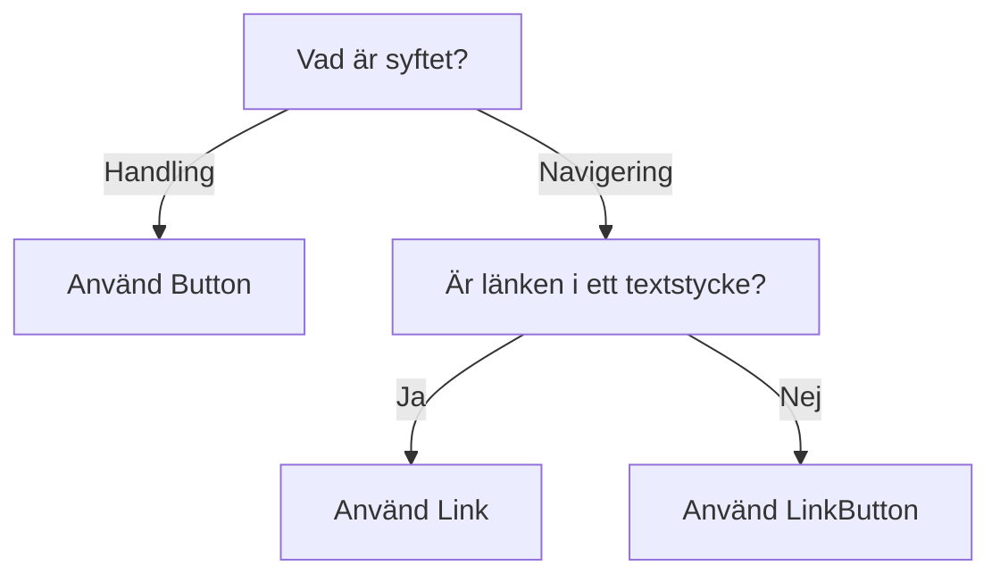

import { PropTable } from '@site/src/components/propsTable'
import {
  ComponentHeader,
  ComponentFooter
} from '@site/src/components/getComponentMetaData'
import Info from '@site/static/data/link.json'
import { Link } from '@midas-ds/link'
import LiveCodeBlock from '@site/src/components/CodeBlock/CodeBlock'

<ComponentHeader
  name={'Link'}
  info={Info}
  friendlyName={'Länk'}
/>

## Introduktion

Komponenten Link skapar en länk som kan vara i ett textstycke eller fristående.

## Installation och användning

```bash npm2yarn
npm install @midas-ds/link
```

```tsx
import { Link } from '@midas-ds/link'
```

<LiveCodeBlock scope={{ Link }}>
  {`<p>Designsystemet utvecklas ständigt, <Link href="/blog">vilket du kan läsa mer om här i vår releasefeed.</Link> Varannan vecka kommer det ett nytt släpp med buggfixar, nya komponenter eller nya funktioner på befintliga komponenter.</p>`}
</LiveCodeBlock>

## Fristående

Använd `standalone` för att använda komponenten som en fristående länk under t.ex ett textblock.

<LiveCodeBlock scope={{ Link }}>
  {`<>
    <p>Designsystemet utvecklas ständigt. Varannan vecka kommer det ett nytt släpp med buggfixar, nya komponenter eller nya funktioner på befintliga komponenter.</p>
    <Link 
        standalone 
        href="/blog"
    >
        Läs mer om designsystemets nyheter
    </Link>
</>`}
</LiveCodeBlock>

## Riktlinjer

### Val av komponent



## Beroenden

<ComponentFooter info={Info} />
