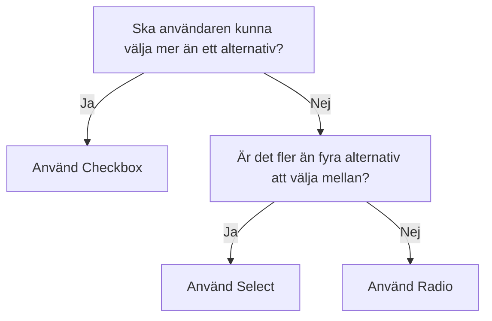

import { MultiSelect } from '@midas-ds/multi-select'
import { PropTable } from '@site/src/components/propsTable'
import {
  ComponentHeader,
  ComponentFooter
} from '@site/src/components/getComponentMetaData'
import Info from '@site/static/data/select.json'
import LiveCodeBlock from '@site/src/components/CodeBlock/CodeBlock'

<ComponentHeader
  name={'MultiSelect'}
  info={Info}
  friendlyName={'Flerval, multiväljare, dropdown'}
/>

## Introduktion

En MultiSelect visar en hopfällbar lista med alternativ och låter en användare välja ett eller flera av dem.

MultiSelect är en typ av inmatningsfält som används för att välja **ett eller flera** alternativ från en uppsättning av flera alternativ. Om det ska gå att välja flera eller inget alternativ men är det [Checkbox](./checkbox.mdx) som ska användas
Om det är färre alternativ än fem används med fördel [Radio](./radio.mdx) istället.

## Installation och användning

```bash npm2yarn
npm install @midas-ds/select
```

```tsx
import { MultiSelect } from '@midas-ds/multi-select'
```

<LiveCodeBlock scope={{ MultiSelect }}>
  {`<MultiSelect
        label="Vad är din favoritfrukt?"
        placeholder="Välj en frukt"
        items={fruits.map(fruit => {return {id: fruit.value, name: fruit.name}})}
/>`}
</LiveCodeBlock>

## Riktlinjer

### Val av komponent



## Beroenden

<ComponentFooter info={Info} />
