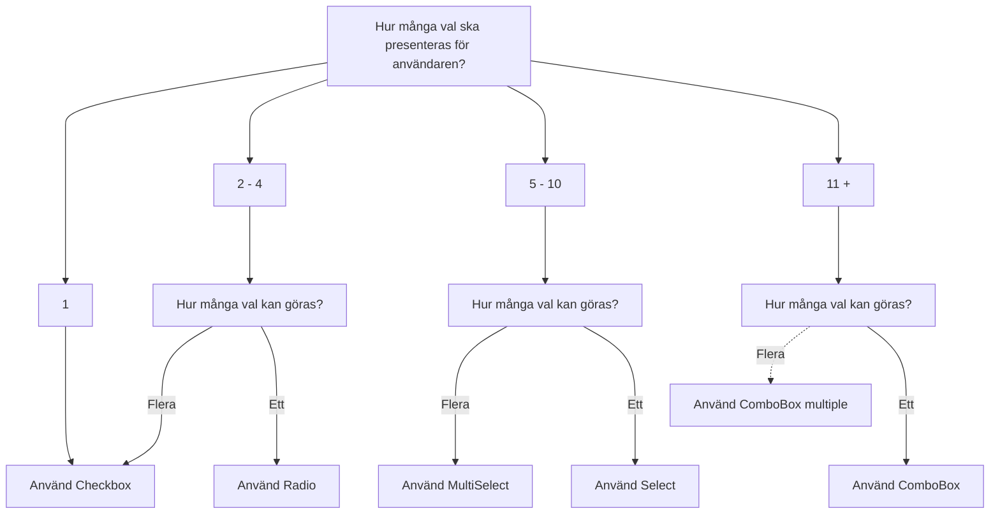

import { PropTable } from '@site/src/components/propsTable'
import { Radio, RadioGroup } from '../../../../packages/radio/src'
import { Button } from '../../../../packages/button/src'
import {
  ComponentHeader,
  ComponentFooter
} from '@site/src/components/getComponentMetaData'
import Info from '@site/static/data/radio.json'
import LiveCodeBlock from '@site/src/components/CodeBlock/CodeBlock'

<ComponentHeader
  name={'Radio'}
  info={Info}
  friendlyName={'Radioknappar'}
  overrideHeadlessLink='https://react-spectrum.adobe.com/react-aria/RadioGroup.html'
/>

## Introduktion

Radioknappar är en typ av inmatningsfält som används för att välja ett (1) alternativ från en uppsättning av flera alternativ. Om det är fler alternativ än fem bör [Select](./select.mdx) användas istället.

## Installation och användning

```bash npm2yarn
npm install @midas-ds/radio
```

```tsx
import { Radio, RadioGroup } from '@midas-ds/radio'
```

<LiveCodeBlock scope={{ RadioGroup, Radio }}>
  {`<RadioGroup label={'Välj en frukt'} description={'Perfekt komponent när ett val ska väljas'}>
    {fruits.shuffled(3).map(fruit => (
      <Radio key={fruit.value} value={fruit.value}>{fruit.name}</Radio>
    ))}
</RadioGroup>`}
</LiveCodeBlock>

### Disabled

Sätt `isDisabled` antingen på `RadioGroup` eller på enskilda val av `Radio`

<LiveCodeBlock scope={{ RadioGroup, Radio }}>
  {`<RadioGroup label={'Välj en frukt'} description={'Perfekt komponent när ett val ska väljas'} isDisabled>
    {fruits.shuffled(3).map(fruit => (
      <Radio key={fruit.value} value={fruit.value}>{fruit.name}</Radio>
       ))}
</RadioGroup>`}
</LiveCodeBlock>

### Validering

Sätt validering med `isInvalid` eller använd inbyggda tester som `isRequired`.

## Riktlinjer

### Val av komponent



- En av radioknapparna ska alltid vara ifylld. Om du misstänker att användaren vill kunna avstå från att välja något, skapa ett sista alternativ som du kallar "Inget av ovanstående" eller liknande.
- Givet ovanstående riktlinje kan radioknappar inte användas ensamma, utan måste alltid vara två eller flera.
- Radioknapparna placeras som regel vertikalt för att underlätta avläsning. Om antalet alternativ för en given fråga är begränsat till två (2) och det är ont om vertikalt utrymme så kan en horisontell orientering användas.
- Fältetiketten ska inledas med stor bokstav och inte följas av punkt.

<ComponentFooter info={Info} />
