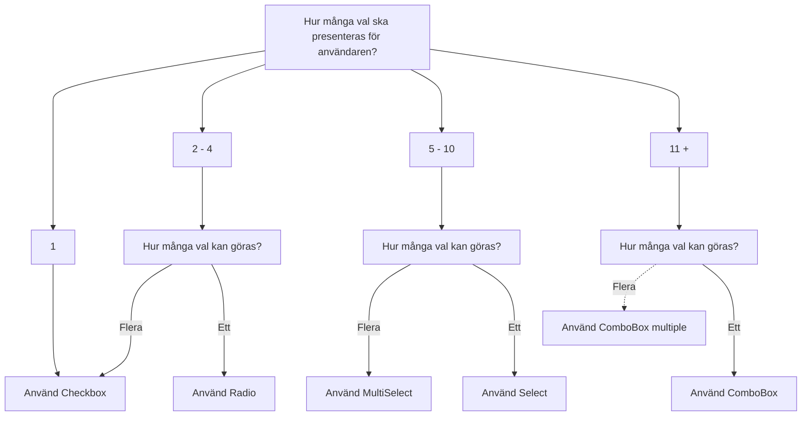

import { Select, Item } from '@midas-ds/select'
import { PropTable } from '@site/src/components/propsTable'
import { ComponentHeader, ComponentFooter } from '@site/src/components/getComponentMetaData'
import Info from '@site/static/data/select.json'
import LiveCodeBlock from '@site/src/components/CodeBlock/CodeBlock'

<ComponentHeader
  name={'Select'}
  info={Info}
  friendlyName={'Flerval, väljare, dropdown'}
/>

## Introduktion

Select är en typ av inmatningsfält som används för att välja **ett** alternativ från en uppsättning av flera alternativ. Om det är färre alternativ än fem bör [Radio](./radio.mdx) användas istället.

## Installation och användning

```bash npm2yarn
npm install @midas-ds/select
```

```tsx
import { Item, Select } from '@midas-ds/select'
```

<LiveCodeBlock scope={{ Select, Item }}>
  {`<Select
    label="Vad är din favoritfrukt?"
    placeholder="Välj en frukt"
    items={fruits.map(fruit => {return {id: fruit.value, name: fruit.name}})}
>
    {(item) => <Item>{item.name}</Item>}
</Select>`}
</LiveCodeBlock>

## Beroenden

<ComponentFooter info={Info} />

## Riktlinjer

### Val av komponent



<ComponentFooter info={Info} />
