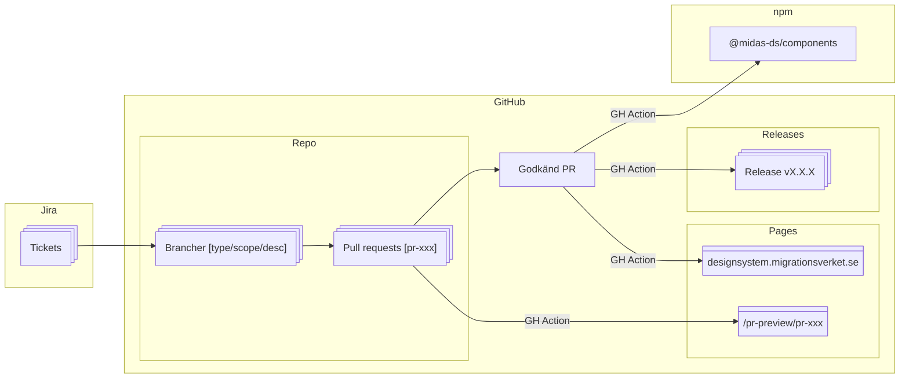

# Bidra till komponentbiblioteket

Att komma igång och bidra med kod till Midas är enkelt!

## Du behöver

- En normalt fungerande WSL eller motsvarande setup med Node version >22.
- [Nx](https://nx.dev) installerat globalt `npm install --global nx@latest`

```bash
npm install
```

### Starta Dokumentationswebben

```bash
nx serve docs
```

### Starta Storybook

```bash
nx run components:storybook
```

### Starta Playground-appen (React)

Kan användas för att testa komponenter i ett sammanhang utanför Storybook.

```bash
nx serve playground
```

Vi har även en remix och en next.js-app uppsatta - byt playground mot `remix|next`

### Komponentbibliotek

Alla komponenter ligger under `/packages/components` och exporteras som ett npm-paket [`@midas-ds/components`](https://www.npmjs.com/package/@midas-ds/components).

- Kör enhetstester för komponentbiblioteket

```bash
nx test components
```

### Dokumentationswebb

Dokumentationswebben ligger i `apps/docs` och är byggd med [Docusaurus](https://docusaurus.io/).

- Kör dokumentationen lokalt:

```bash
nx serve docs
```

### Bygg komponentbibliotek

Komponentbibliotek och appar kan byggas med:

```shell
nx build <namn>
```

och allt som byggs hamnar i `/dist`. Om du vill testa utanför monorepot går det att zippa med `npm pack` och installera i
separat app med `npm install [sökväg]`.

## Instruktioner för Git

### Branch

Branch namnges enligt `[feature|bugfix|hotfix|docs|refactor|chore|test]/[scope]/`, till exempel `feature/button`.

### Commit

Commits görs enligt [conventional commits](https://www.conventionalcommits.org/en/v1.0.0/#summary). Använd engelska,
imperativ form, definiera type `feat|docs|fix|refactor|test|ci` och scope `(button|etc...)` och lägg till referenser
till andra issues vid behov. Tänk på att även en merge (med squash) skapar en commit så lägg en extra tanke på
vilken information som kommer med och inte kommer med. Våra commits är hela projektets historik och är indata till
changelogs och release notes så lägg gärna en extra minut på att vara tydlig.

#### Varför conventional commits?

    - Generera automatisk CHANGELOG
    - Automatiskt bestämma `semantic version`
    - Kommunicera inom team och till andra intressenter vad förändringen gäller.
    - Trigga byggen och andra åtgärder.
    - Bidra till att hålla en konsekvent och strukturerad historik.

#### Commit message på en rad

`docs(lang): add Swedish language`

#### Commit message med header och body

```
fix: prevent red color on button hover

Introduce new css variable to automatically
select style based on input type

```

## Bygga komponenter

### Styleguide

Generellt, använd övriga komponenter som referens när nya läggs till.

- Som standard, exportera en komponent per fil
- Använd barrel-files `index.ts` för att exportera hela mappar
- Formatera enligt [Prettier](https://prettier.io/) standard
- Använd variabler så långt det är möjligt i CSS (importeras från `tokens.ts`)

### Importera headless-bibliotek

Komponenter ska i första hand byggas på [React Aria](https://react-spectrum.adobe.com/react-aria/getting-started.html) i den mån det går. React Aria har ett omfattande bibliotek av
färdiga komponenter och hooks som går att kombinera ihop för att uppnå önskat resultat. Fördelen med att följa React Arias
konventioner är att det följer med mycket gratis i form av stöd för skärmläsare, tangentbordsnavigation och olika states.

### Skriv enhetstester

Ur perspektivet att tillgänglighet är ett av designsystemets viktigaste fokusområden är det viktigt att vi regressionstestar.
Använd [axe-core](https://github.com/dequelabs/axe-core) för att fånga upp problem innan de blir buggar. Det finns inget
specificerat mål någon viss code coverage men ta inspiration från headless-biblioteken. Grundläggande funktion av komponenter
bör också täckas av enhetstester.

### Skapa stories

I utgångspunkt bör alla states finnas representerade som stories i Storybook. Storybook är i första hand ett internt
verktyg för UX och utvecklare i designsystemet men också en publikt exponerad referens för komponenterna.

### Dokumentation

Komponenten dokumenteras på dokumentationswebben med lämpliga exempel, beskrivning och properties. Normalt plockas
properties upp från komponenten via [react-docgen-typescript](https://github.com/styleguidist/react-docgen-typescript)
men om det har införts nya types eller interfaces kan de behöva specificeras enligt [JSDoc](https://jsdoc.app/).

---

## Release & publish

Designsystemet använder Nx för versionshantering och release enligt [nx release](https://nx.dev/recipes/nx-release/get-started-with-nx-release).
När du kör `nx release --skip-publish` räknas komponentbiblioteket upp till rätt version
och Nx gör en commit med uppdaterad changelog samt sätter en git tag med versionsnummer. Pusha till remote
`git push --follow-tags` vilket i sin tur triggar en publicering till NPM. Kör gärna en `--dry-run` först
och kontrollera att allt stämmer.

```bash
nx release --skip-publish --dry-run // remove dry-run when you know it works
```

---

## Arbetsflöde


