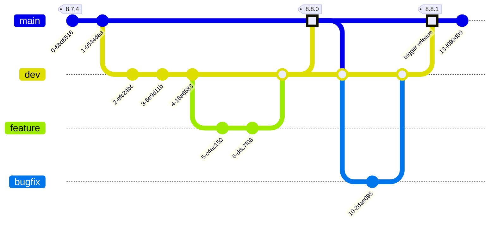

# Bidra till komponentbiblioteket

Att komma igång och bidra med kod till Midas är enkelt!

## Du behöver

- En normalt fungerande WSL eller motsvarande setup med Node version >22.
- [Nx](https://nx.dev) installerat globalt `npm install --global nx@latest`

```bash
npm install
```

### Starta Storybook

```bash
nx run components:storybook
```

### Starta Playground-appen (React)

Kan användas för att testa komponenter i ett sammanhang utanför Storybook.

```bash
nx serve playground
```

Vi har även en remix och en next.js-app uppsatta - byt playground mot `remix|next`

### Komponentbibliotek

Alla komponenter ligger under `/packages/components` och exporteras som ett npm-paket [`@midas-ds/components`](https://www.npmjs.com/package/@midas-ds/components).

- Kör enhetstester för komponentbiblioteket

```bash
nx test components
```

### Dokumentationswebb

Dokumentationswebben ligger i `apps/docs` och är byggd med [Docusaurus](https://docusaurus.io/).

- Kör dokumentationen lokalt:

```bash
nx serve docs
```

### Bygg komponentbibliotek

Komponentbibliotek och appar kan byggas med:

```shell
nx build <namn>
```

och allt som byggs hamnar i `/dist`. Om du vill testa utanför monorepot går det att zippa med `npm pack` och installera i
separat app med `npm install [sökväg]`.

## Instruktioner för Git

### Branch

Branch namnges enligt `[feature|bugfix|hotfix|docs|refactor|chore|test]/[scope]/`, till exempel `feature/button`.

### Commit

Commits görs enligt [conventional commits](https://www.conventionalcommits.org/en/v1.0.0/#summary). Använd engelska,
imperativ form, definiera type `feat|docs|fix|refactor|test|ci` och scope `(button|etc...)` och lägg till referenser
till andra issues vid behov. Tänk på att även en merge (med squash) skapar en commit så lägg en extra tanke på
vilken information som kommer med och inte kommer med. Våra commits är hela projektets historik och är indata till
changelogs och release notes så lägg gärna en extra minut på att vara tydlig.

#### Varför conventional commits?

    - Generera automatisk CHANGELOG
    - Automatiskt bestämma `semantic version`
    - Kommunicera inom team och till andra intressenter vad förändringen gäller.
    - Trigga byggen och andra åtgärder.
    - Bidra till att hålla en konsekvent och strukturerad historik.

#### Commit message på en rad

`docs(lang): add Swedish language`

#### Commit message med header och body

```
fix: prevent red color on button hover

Introduce new css variable to automatically
select style based on input type

```

Ta dig gärna tid att läsa igenom [conventional commit summary](https://www.conventionalcommits.org/en/v1.0.0-beta.3/#summary)
och försök jobba enligt det flödet.

:::tip

- Jobbar du ensam i en feature branch och vill städa upp? Använd `git rebase -i`
- Har du en feature branch som egentligen bara rör ett fåtal områden? Då kanske du vill vara mindre strikt
  med commits och använda `git squash` istället
  :::

## Bygga komponenter

### Styleguide

Generellt, använd övriga komponenter som referens när nya läggs till. React Aria är en bra inspiration för namngivning
och struktur, både via deras ostylade komponentbibliotek och via sin designsystemsimplementation
[React Spectrum](https://github.com/adobe/react-spectrum/tree/main/packages/%40react-spectrum).

- Målet är små funktioner, små komponenter, clean code. Det uppmuntras att hela tiden göra inkrementella förbättringar
- Formatera enligt [Prettier](https://prettier.io/) standard
- Importera och använd tokens i `[component].module.css` enligt

```css title="Button.module.css"
// highlight-start
@value tokens: "../theme/tokens.css";
@value --button-background-primary from tokens;
// highlight-end
.button {
    background-color: --button-background-primary;
}
```

### Importera headless-bibliotek

Komponenter ska i första hand byggas på [React Aria](https://react-spectrum.adobe.com/react-aria/getting-started.html) i den mån det går. React Aria har ett omfattande bibliotek av
färdiga komponenter och hooks som går att kombinera ihop för att uppnå önskat resultat. Fördelen med att följa React Arias
konventioner är att det följer med mycket gratis i form av stöd för skärmläsare, tangentbordsnavigation och olika states.

### Skapa stories

I utgångspunkt bör alla states finnas representerade som stories i Storybook. Storybook är i första hand ett internt
verktyg för UX och utvecklare i designsystemet men också en publikt exponerad referens med API och visuell
representation av komponenterna.

### Skriv enhetstester

Ur perspektivet att tillgänglighet är ett av designsystemets viktigaste fokusområden är det viktigt att vi regressionstestar och testar
så stor del av möjliga states av alla komponenter på enhetsnivå. MIDAS använder primärt
[Storybook som testplattform](https://storybook.js.org/docs/writing-tests). De stories du skapat för komponenter kan du nu använda som utgångspunkt för dina tester. Läs mer om [hur vi förhåller oss till tester av våra komponenter](#testa-komponenter).

### Dokumentation

Komponenten dokumenteras på dokumentationswebben med lämpliga exempel, beskrivning och properties. Normalt plockas
properties upp från komponenten via [react-docgen-typescript](https://github.com/styleguidist/react-docgen-typescript)
men om det har införts nya types eller interfaces kan de behöva specificeras enligt [JSDoc](https://jsdoc.app/).

## Testa komponenter

För tillfället har vi _komponenttester_, som testar renderade komponenter i en riktig eller emulerad webbläsare.
I de riktiga webbläsarna utförs _tillgänglighetstester_ och på sikt även _visuella tester_.

Vi har också möjlighet att skriva _enhetstester_ som testar delar ur JavaScript-moduler.

### Webbläsartester

Som redan nämnts så använder Midas Storybook som primär testplattform, med Storybooks playfunktion får vi tillgång till ett flertal riktiga webbläsare som kan köra våra tester lokalt och i våra CI/CD pipelines.
Skriv ditt test här i första hand, det hjälper oss att säkerställa att vi har stories för en komponents samtliga tillstånd.

#### Kör webbläsartester lokalt

Tester som använder Storybooks play-funktion kan köras via terminalen med hjälp av [Storybook test runner](https://storybook.js.org/docs/writing-tests/test-runner).
Under huven används [Jest](https://jestjs.io/), [Playwright](https://playwright.dev/) och [Testing library](https://testing-library.com/).

Se till att ha din lokala Storybook igång innan du kör några tester:

```bash
nx run components:storybook
```

##### Kör tester i light mode

```bash
nx run components:test-storybook
```

##### Kör tester i dark mode

Vi behöver testa att våra komponenter uppfyller tillgänglighetskrav i mörkt läge, vi testar detta med följande kommando:

```bash
nx run components:test-storybook:dark-mode
```

##### Kör tester kontinuerligt när du sparar en fil

```bash
nx run components:test-storybook --watch
```

#### Skriva webbläsartester

Mycket kan testas på våra komponenter, och mycket kanske redan testas av de bibliotek vi utgår ifrån.
Försök skriva ett test som kompletterar redan skrivna tester, kom ihåg att ditt test kommer behöva underhållas i framtiden.

##### Interaktioner och förväntade tillstånd

Erbjuder din komponent interaktion kan du skriva tester där en simulerad användare använder musen eller tangentbordet för att framkalla ett visst tillstånd.
Använd `userEvent` från `@storybook/test` när du simulerar din användare.

##### Tillgänglighetstester

Med [@storybook/addon-a11y](https://storybook.js.org/docs/writing-tests/accessibility-testing) utförs tillgänglighetstester på varje komponent, dessa testas även av Storybook test runner i samtliga play tester, se `packages/components/.storybook/test-runner.ts`.

Automatiserade tillgänglighetstester fångar upp en stor del av brister jämtemot [WCAG](https://www.w3.org/WAI/standards-guidelines/wcag/)-standarden men kan självklart kompletteras.

:::tip
Med hjälp av tangentbords-interaktion i dina interaktionstester testar du att din komponent kan användas med enbart tangentbordet.
Du kan också välja att använda queries för att säkerställa att du använder DOM-element som säger något åt en skärmläsare, `getByRole`, `getByLabelText` osv.
:::

##### Bugrättning med TDD

Om du rättar en bug erbjuds du ett unikt tillfälle att skriva ett test som återskapar din bug, förhoppningsvis kommer vi då inte att återinföra bugen.

Börja med att sätta upp berörd komponent i en separat story, skriv sedan ett test som återskapar din bug, ditt mål är att få ett test som "failar".

```tsx
// Ett bra tillfälle att notera ärendenumret som beskriver felet
export const DS123: Story = {
  // Dölj gärna storyn från Storybooks UI om den inte ger något direkt värde åt andra intressenter
  tags: ['!dev', '!autodocs'],
  args: {
    label: 'Select a value',
    options: [{ id: 'banana', name: 'Banana' }],
  },
  play: async ({ args, step, canvas }) => {
    // Använd gärna den inbyggda step-funktionen för att beskriva vad ditt test gör
    await step('It should be possible to select a value with the keyboard', async () => {
      // Interagera med userEvent
      await userEvent.tab()
      await userEvent.keyboard('[Space]')
      await userEvent.keyboard('[Space]')
      // Skriv minst en förväntning med expect
      expect(canvas.getByLabelText(args.label as string)).toHaveDisplayValue('banana')
    })
  },
}
```

Nu kan du åtgärda din bug, när du är klar bör ditt test passera.

##### Visuella tester

För närvarande utför vi inga visuella tester där screenshots används för att jämföra komponenters utseende.

###### toHaveStyle

`expect` från `@storybook/test` erbjuder dig att skriva förväntningar på hur en komponent ser ut med hjälp av `toHaveStyle`-metoden.
Då [metoden inte är helt pålitlig](https://github.com/testing-library/jest-dom/issues/350) bör den användas som en sista utväg tillsammans med `lightDark`-utilityn från `packages/components/src/utils/test.ts`.

### Enhetstester eller tester med emulerad webbläsare

Behöver du skriva enhetstester av rena JavaScript-moduler eller använda en emulerad webbläsare (jsdom) för att testa dina komponenter kan du använda filnamn enligt mönstret `**/?(*.)+(spec|test).[jt]s?(x)`.
Exempelvis: `packages/components/src/badge/badge.spec.ts`

#### Kör enhetstester

```bash
nx test components
```

#### Kör enhetstester kontinuerligt när du sparar en fil

```bash
nx test components --watch
```

#### Skriva enhetstester

I våra `.spec|.test`-filer används Jest för att köra tester och metoder är definerade globalt, det krävs därför inga importer, se exempel nedan.

Om du har en separerad kod kan du importera delar av en JavaScript-modul och kontrollera att den fungerar som du vill med hjälp av ett test.
Gör något i stil med:

```ts title="sum.spec.ts"
import sum from './sum'

test('adds 1 + 2 to equal 3', () => {
  expect(sum(1, 2)).toBe(3)
})
```

#### Skriva komponenttester med emulerad webbläsare

Om du av någon anledning behöver skriva ett komponenttest med en emulerad webbläsare behöver du använda `screen` och `expect` från `@testing-library/react`.
Hämta även en uppsatt simulerad användare från `packages/components/tests/utils/user` om du behöver interagera med din komponent.

Sätt gärna upp en komponent i `beforeEach`-hooken så att det är lätt att skriva flera tester på samma tillstånd.

```tsx title="Button.spec.tsx"
describe('given a default Button', () => {
  const label = 'my button'

  beforeEach(() => {
    render(<Button>{label}</Button>)
  })

  it('should be visible', async () => {
    expect(screen.getByLabelText(label)).toBeVisible()
  })
})
```

---

## Arbetsflöde versionshantering


