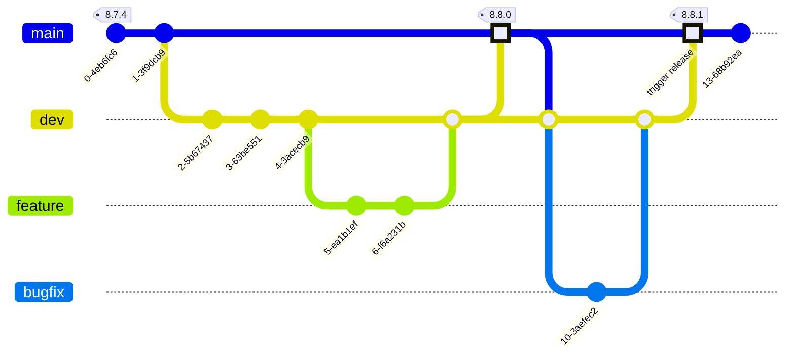

# Bidra till komponentbiblioteket

Att komma igång och bidra med kod till Midas är enkelt!

## Du behöver

- En normalt fungerande WSL eller motsvarande setup med Node version >22.
- [Nx](https://nx.dev) installerat globalt `npm install --global nx@latest`

```bash
npm install
```

### Starta Storybook

```bash
nx run components:storybook
```

### Starta Playground-appen (React)

Kan användas för att testa komponenter i ett sammanhang utanför Storybook.

```bash
nx serve playground
```

### Komponentbibliotek

Alla komponenter ligger under `/packages/components` och exporteras som ett npm-paket [`@midas-ds/components`](https://www.npmjs.com/package/@midas-ds/components).

### Tester

- Kör enhetstester för komponentbiblioteket, mer info finns på [sidan om tester](../tests)

```bash
nx test components
```

### Dokumentationswebb

Dokumentationswebben ligger i `apps/docs` och är byggd med [Docusaurus](https://docusaurus.io/).

- Kör dokumentationen lokalt:

```bash
nx serve docs
```

### Bygg komponentbibliotek

Komponentbibliotek och appar kan byggas med:

```shell
nx build <namn>
```

och allt som byggs hamnar i `/dist`. Om du vill testa utanför monorepot går det att zippa med `npm pack` och installera i
separat app med `npm install [sökväg]`.

## Instruktioner för Git

### Branch

Branch namnges enligt `[feature|bugfix|hotfix|docs|refactor|chore|test]/[scope]/`, till exempel `feature/button`.

### Commit

Commits görs enligt [conventional commits](https://www.conventionalcommits.org/en/v1.0.0/#summary). Använd engelska,
imperativ form, definiera type `feat|docs|fix|refactor|test|ci` och scope `(button|etc...)` och lägg till referenser
till andra issues vid behov. Tänk på att även en merge (med squash) skapar en commit så lägg en extra tanke på
vilken information som kommer med och inte kommer med.

> Våra commits är hela projektets historik och är indata till
> changelogs och release notes så lägg gärna en extra minut på att vara tydlig.

#### Varför conventional commits?

    - Generera automatisk CHANGELOG
    - Automatiskt bestämma `semantic version`
    - Kommunicera inom team och till andra intressenter vad förändringen gäller.
    - Trigga byggen och andra åtgärder.
    - Bidra till att hålla en konsekvent och strukturerad historik.

#### Commit message på en rad

`docs(lang): add Swedish language`

#### Commit message med header och body

```
fix: prevent red color on button hover

Introduce new css variable to automatically
select style based on input type
```

###

Ta dig gärna tid att läsa igenom [conventional commit summary](https://www.conventionalcommits.org/en/v1.0.0-beta.3/#summary)
och försök jobba enligt det flödet.

:::info
Innan du skapar en PR, gå igenom så att du har commits som representerar vad du har gjort.
Jobbar du ensam i en feature branch och har skapat många commits? Använd `git rebase -i`,
då kan du välja vilka commits som ska vara med och vilka som kan slås samman.
:::

Instruktioner för hur du använder `git rebase` finns [här](https://www.atlassian.com/git/tutorials/rewriting-history/git-rebase).

## Bygga komponenter

### Styleguide

Generellt, använd övriga komponenter som referens när nya läggs till. React Aria är en bra inspiration för namngivning
och struktur, både via deras ostylade komponentbibliotek och via sin designsystemsimplementation
[React Spectrum](https://github.com/adobe/react-spectrum/tree/main/packages/%40react-spectrum).

- Målet är små funktioner, små komponenter, clean code. Det uppmuntras att hela tiden göra inkrementella förbättringar
- Formatera enligt [Prettier](https://prettier.io/) standard
- Importera och använd tokens i `[component].module.css` enligt

```css title="Button.module.css"
// highlight-start
@value tokens: "../theme/tokens.css";
@value --button-background-primary from tokens;
// highlight-end

.button {
    background-color: --button-background-primary;
}
```

### Importera headless-bibliotek

Komponenter ska i första hand byggas på [React Aria](https://react-spectrum.adobe.com/react-aria/getting-started.html) i den mån det går. React Aria har ett omfattande bibliotek av
färdiga komponenter och hooks som går att kombinera ihop för att uppnå önskat resultat. Fördelen med att följa React Arias
konventioner är att det följer med mycket gratis i form av stöd för skärmläsare, tangentbordsnavigation och olika states.

### Skapa stories

I utgångspunkt bör alla states finnas representerade som stories i Storybook. Storybook är i första hand ett internt
verktyg för UX och utvecklare i designsystemet men också en publikt exponerad referens med API och visuell
representation av komponenterna.

### Skriv enhetstester

Ur perspektivet att tillgänglighet är ett av designsystemets viktigaste fokusområden är det viktigt att vi regressionstestar och testar
så stor del av möjliga states av alla komponenter på enhetsnivå. MIDAS använder primärt
[Storybook som testplattform](https://storybook.js.org/docs/writing-tests). De stories du skapat för komponenter kan du nu använda som utgångspunkt för dina tester.
Läs mer om [hur vi förhåller oss till tester av våra komponenter](../tests).

### Dokumentation

Komponenten dokumenteras på dokumentationswebben med lämpliga exempel, beskrivning och properties. Normalt plockas
properties upp från komponenten via [react-docgen-typescript](https://github.com/styleguidist/react-docgen-typescript)
men om det har införts nya types eller interfaces kan de behöva specificeras enligt [JSDoc](https://jsdoc.app/).

---

## Arbetsflöde versionshantering


## Release

:::info
Endast Midas core-team har de nödvändiga rättigheterna för att göra nya releaser.
:::

Release av ny version triggas av push till `main` branch. Processen är följande:

1.  **Säkerställ att `main` är uppdaterad med senaste från `dev`**:
    Innan du initierar en release, säkerställ att `main` branchen är fullständigt uppdaterad med de senaste ändringarna från `dev`.
    Detta görs genom att lokalt merga `dev` till `main`.

    ```bash
    git checkout main && git pull origin main
    git merge origin dev --ff
    ```

2.  **Skapa en pull-request för verifiering**:
    Gå till GitHub och skapa en pull-request från din branch till `main`. Detta steg är för att verifiera att alla byggen och kontroller passerar korrekt. Denna pull-request kommer att stängas automatiskt när du senare pushar direkt till `main`.

3.  **Verifiera release-versionen**:
    Innan du skapar en pull-request, kör en "dry run" av releasen för att se vilken version som kommer att skapas.

    ```bash
    nx release --dry-run
    ```

4.  **Lägg till release-anteckningar för breaking changes**:
    Om du introducerar "breaking changes" eller större förändringar, skapa en ny release-anteckning och committa den. Release-anteckningarna finns i `/blog/release-notes`.

    ```bash
    git add .
    git commit -m "docs(release): add release notes for version <version>"
    ```

5.  **Pusha ändringarna till `main`**:
    När du har verifierat att allt ser korrekt ut, pusha ändringarna till `main` på remote. Detta kommer att starta den automatiserade release-processen.

    ```bash
    git push origin main
    ```

6.  **Skapa GitHub Release och notifiera**:
    Skapa en GitHub-release med standardinställningar. Meddela sedan teamet och supportkanalen att en ny version har publicerats.

### Automatiserad release-process

När en push sker till `main`, startar en GitHub Action som utför följande steg:

1.  **Checkout och installation**:
    Processen börjar med att checka ut `main`-branchen och installera alla nödvändiga paket.

2.  **Bygga komponenter**:
    Komponentbiblioteket byggs för att säkerställa att allt är korrekt.

3.  **`nx release`**:
    Kommandot `npx nx release --skip-publish` körs. Detta kommando gör följande:
    -   Analyserar alla commits sedan senaste releasen.
    -   Bestämmer nästa versionnummer baserat på [semantic versioning](https://semver.org/).
    -   Uppdaterar `package.json` med det nya versionnumret.
    -   Genererar en `CHANGELOG.md` baserat på conventional commits.
    -   Skapar en ny git-tagg med det nya versionnumret.

4.  **Push och pull-request**:
    -   De nya ändringarna (inklusive `package.json` och `CHANGELOG.md`) pushas till `main`.
    -   Den nya taggen pushas till `main`.
    -   En pull-request skapas automatiskt för att merga tillbaka release-anteckningarna från `main` till `dev`.

5.  **Synkronisera `dev`**:
    `dev`-branchen synkroniseras med `main` för att inkludera de senaste ändringarna.

Efter att processen är klar, kommer en ny version av komponentbiblioteket att vara publicerad på npm och en ny release kommer att finnas på GitHub.


