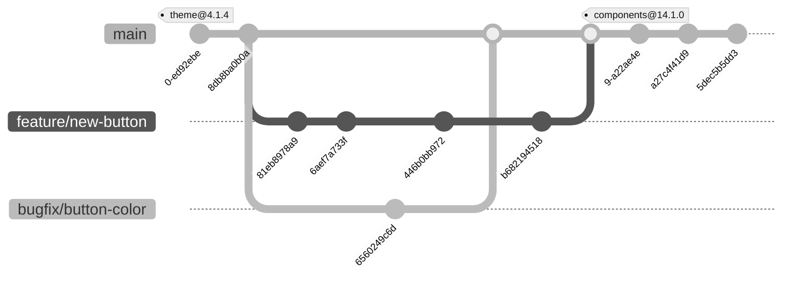

# Bidra till komponentbiblioteket

Att komma igång och bidra med kod till Midas är enkelt!

## 🤝 Gemenskapsdriven utveckling

Midas komponentbibliotek är **gemenskapsdriven** - det är ett strategiskt mål att biblioteket produceras av och för användarcommunityn. Ett litet core-team ansvarar för att hantera projektet och säkerställa kvalitet, men **bidrag från användare är mer än välkomna**.

Ett av våra viktigaste mål är att erbjuda en så bra **developer experience (DX)** som möjligt. För att uppnå detta behöver vi er feedback, era idéer och era bidrag. Genom att vara gemenskapsdriven säkerställer vi att biblioteket möter verkliga behov och utmaningar som ni stöter på i era projekt.

**Hur du kan bidra:**
- Rapportera buggar och föreslå förbättringar
- Bidra med kod för nya komponenter eller funktionalitet
- Förbättra dokumentation
- Delta i diskussioner och code reviews
- Dela din erfarenhet av att använda Midas

Din feedback och ditt engagemang är avgörande för att göra Midas bättre. Tveka inte att höra av dig!

## 🛠️ Kom igång

Node version >22 krävs. Installera [Nx](https://nx.dev) globalt: `npm install --global nx@latest`

### Nx

Midas är ett monorepo som hanteras med [Nx](https://nx.dev). Det innebär att vi har flera olika projekt i samma repo, till exempel komponentbiblioteket, dokumentationswebben och andra verktyg. Varje projekt har sitt eget scope och kan hanteras individuellt. Du kan köra `nx graph` för att se en visuell representation av hur projekten är relaterade till varandra. Eftersom vissa projekt är beroende av andra, kan en ändring i ett projekt innebära att ett annat projekt också behöver en ny version. Till exempel, om `theme` uppdateras, så kommer `components` som är beroende av `theme` också att få en ny version.

### Starta Storybook

```bash
nx serve storybook
```

### Komponentbibliotek

Alla komponenter ligger under `/packages/components` och exporteras som ett npm-paket [`@midas-ds/components`](https://www.npmjs.com/package/@midas-ds/components).

### Tester

```bash
nx test components
```

Mer info finns på [sidan om tester](../tests).

### Dokumentationswebb

Dokumentationswebben ligger i `apps/docs` och är byggd med [Docusaurus](https://docusaurus.io/).

```bash
nx serve docs    # Kör lokalt
nx build docs    # Produktionsbygge
```

#### API

Vid ett produktionsbygge samlas information om komponenternas typescript-typer in och visas med hjälp av en tabell under rubriken API på varje komponentsida.
För snabbare uppstart är detta inaktiverat per default i `serve`-kommandot, men du kan aktivera det om du behöver se API-tabellerna under utveckling:

```bash
DOCUSAURUS_HIDE_API=false nx serve docs
```

### Testa lokalt end-to-end

För att testa komponentbiblioteket i en annan app kan du publicera det till ett lokalt npm-registry:

```bash
nx run @midas-ds/source:release:local:dev
```

Detta startar ett lokalt Verdaccio-registry och publicerar alla paket. Du kan sedan installera dem i ett testprojekt:

```bash
npm install @midas-ds/components@latest --registry=http://localhost:4873/
```

Mer information finns i `tools/release-local/README.md`.

## 🌿 Arbetsflöde versionshantering

Vi använder en enkel branchstrategi med en `main`-branch som alltid ska vara i ett deploybart skick. Utveckling sker i feature- eller bugfix-brancher som sedan mergas in i `main`. Vi använder inte `develop` eller andra liknande brancher för att hålla det enkelt och för att passa ett arbetssätt med kontinuerlig integration och leverans (CI/CD).

Ett exempel på hur det kan se ut i praktiken:



### Branch

Brancher namnges enligt `[feature|bugfix|hotfix|docs|refactor|chore|test]/[scope]/`, till exempel `feature/button`. Scope är valfritt men om det används ska det referera till ett av projekten i monorepot, till exempel `components`, `docs` eller `theme`.

### Commit

Commits görs enligt [conventional commits](https://www.conventionalcommits.org/en/v1.0.0/#summary). Använd engelska,
**imperativ form**, definiera type `feat|docs|fix|refactor|test|chore|ops...` för att avgöra vilken versionsändring du vill göra och scope `(project, component)` som rubrik för changelog.

**Viktigt**: Scope börjar alltid med ett av Nx-projekten (`components`, `theme`, `docs`, etc.) för att versionshanteringen ska fungera korrekt. Komponenter eller features anges som andra parametern efter kommatecken.

Se `.commitlintrc.js` för tillåtna types och scopes.

**Exempel:**

```bash
feat(components, button): add new button variant   # Minor bump för components
fix(theme): fix button hover color                 # Patch för theme
docs: update contribution guide                    # Ingen bump

# Med body för mer kontext
fix(theme): prevent red color on button hover

Introduce new css variable to automatically
select style based on input type
```

:::info
Innan du skapar en PR, städa gärna commit-historiken med `git rebase -i` om du har många commits i din feature branch. [Guide till git rebase](https://www.atlassian.com/git/tutorials/rewriting-history/git-rebase).
:::

## 🏗️ Designfilosofi och arkitektur

Midas designsystem följer principer från Clean Code och Clean Architecture för att säkerställa hög kvalitet, underhållbarhet och långsiktig stabilitet.

### ✨ Clean Code-principer

Vi strävar efter ren, läsbar och underhållbar kod:

- **Små funktioner och komponenter**: Varje komponent har ett tydligt, avgränsat ansvar (Single Responsibility Principle)
- **Beskrivande namn**: Funktioner, variabler och komponenter har namn som tydligt beskriver vad de gör
- **Testbar kod**: Kod struktureras för att vara enkel att testa
- **DRY (Don't Repeat Yourself)**: Undvik kodduplicering genom återanvändning och abstraktion
- **Inkrementella förbättringar**: Lämna koden bättre än du hittade den - fixa gärna problem du ser även om de inte är en del av din uppgift
- **Stateless komponenter**: Komponenter är i möjlig mån stateless och stödjer designsystemet på ett generiskt sätt

### 🏛️ Clean Architecture-principer

Vi tillämpar principer från clean architecture för att skapa ett underhållbart och stabilt komponentbibliotek:

- **Separera styling från beteende**: Använd headless-bibliotek för logik och tillgänglighet, applicera endast visuell stil
- **Minimera beroenden**: Håll komponenter löst kopplade och undvik onödiga beroenden mellan dem
- **Testbarhet**: Komponenter är enkla att testa isolerat utan omfattande setup
- **Stabilitet över flexibilitet**: Välj stabila, välunderhållna beroenden framför att bygga egen komplexitet

### 📦 Beroendestrategi: Headless-bibliotek

#### React Aria Components (RAC) - Förstahandsval

Komponenter byggs **i första hand** på [React Aria Components](https://react-spectrum.adobe.com/react-aria/getting-started.html). React Aria tillhandahåller:

- **Tillgänglighet**: Fullständigt stöd för WCAG, skärmläsare och tangentbordsnavigation
- **Plattformsstöd**: Touch, mouse och keyboard fungerar sömlöst
- **Produktionstestad**: Vältestad kod från Adobe som används i stora produktionsmiljöer
- **Internationalisering**: Inbyggt stöd för olika språk och lokalisering

**Viktigt**: Följ React Aria's API och mönster så nära som möjligt. Undvik att avvika för mycket från originalet då det:
- Försvårar uppgraderingar när React Aria uppdaterar sitt API
- Ökar underhållsbördan för teamet
- Riskerar att vi bygger egen komplexitet som redan är löst

**Best practice**: Om du behöver anpassa beteende, fråga dig först om React Aria redan har en lösning via props, composition eller hooks.

#### Alternativa headless-bibliotek

När funktionalitet **inte finns** i React Aria Components, välj andra välunderhållna headless-bibliotek.

**Exempel på bibliotek vi redan använder:**
- **[TanStack Table](https://tanstack.com/table)**: För avancerad tabellhantering
- **[React Select](https://react-select.com/)**: För komplexa select-komponenter

**Kriterier för att välja ett bibliotek:**
- Välunderhållet och aktivt utvecklat
- Headless (ingen inbyggd styling)
- Stort community och bra dokumentation
- TypeScript-stöd
- Stabilt API med tydlig versionshantering
- Produktionstestat och används av många projekt

Tveka inte att föreslå andra välunderhållna headless-bibliotek om de passar användarfallet bättre.

#### Undvik custom-lösningar

:::warning
Bygg inte egen logik för tangentbordshantering, focus management, ARIA eller accessibility-funktionalitet. Custom-lösningar är svåra att få rätt, ökar underhållsbördan dramatiskt och riskerar att introducera tillgänglighetsbrister.
:::

**När är custom OK?** Endast för ren visuell styling eller små, väldefinierade utilities som inte existerar i headless-bibliotek.

## 🔨 Bygga komponenter

### Styleguide

Generellt, använd övriga komponenter som referens när nya läggs till. React Aria är en bra inspiration för namngivning
och struktur, både via deras ostylade komponentbibliotek och via sin designsystemsimplementation
[React Spectrum](https://github.com/adobe/react-spectrum/tree/main/packages/%40react-spectrum).

- **Formatera enligt [Prettier](https://prettier.io/) standard**
- **Följ existerande patterns**: Se hur liknande komponenter är strukturerade

### Skapa stories

Alla states bör finnas representerade som stories i Storybook. Storybook är i första hand ett internt
verktyg för UX och utvecklare i designsystemet men också en publikt exponerad referens med API och visuell
representation av komponenterna.

### Skriv enhetstester

Eftersom tillgänglighet är ett av designsystemets viktigaste fokusområden är det viktigt att vi regressionstestar och testar
så stor del av möjliga states av alla komponenter på enhetsnivå. MIDAS använder primärt
[Storybook som testplattform](https://storybook.js.org/docs/writing-tests). De stories du skapat för komponenter kan du nu använda som utgångspunkt för dina tester.
Läs mer om [hur vi förhåller oss till tester av våra komponenter](../tests).

### Dokumentation

Komponenten dokumenteras på dokumentationswebben med lämpliga exempel, beskrivning och properties. Normalt plockas
properties upp från komponenten via [react-docgen-typescript](https://github.com/styleguidist/react-docgen-typescript)
men om det har införts nya types eller interfaces kan de behöva specificeras enligt [JSDoc](https://jsdoc.app/).

---

## 🚀 Release

Release sker automatiskt via CI/CD när ändringar mergas till `main`-branchen.

### Hur det fungerar

1. **Automatiska versioner**: När en pull request mergas till `main` analyserar Nx Release alla commits sedan senaste release och räknar fram rätt version baserat på conventional commits.

2. **Publicering**: Om någon package får en ny version publiceras den automatiskt till npm.

3. **Changelog och taggar**: Changelog uppdateras automatiskt och nya git-taggar skapas enligt formatet `nx-project@version`.

4. **Dokumentation**: Dokumentationswebben byggs och publiceras automatiskt med de senaste ändringarna.

### Vad du behöver göra

- **Följ conventional commits**: Dina commits följer conventional commits-standarden, eftersom det avgör vilken versionsändring som sker (major, minor, patch).
- **Merge till main**: När din pull request godkänns och mergas till `main` sker resten automatiskt.

:::info
Du behöver inte köra några manuella release-kommandon. CI/CD-pipelinen hanterar hela releasen automatiskt.
:::
